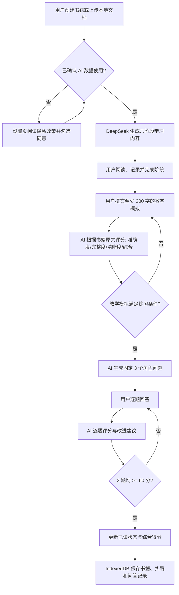

# AI 工作流程与产品状态机

本图只描述当前主流程已经具备的能力。语音输入、自动间隔提醒、可用的多模式选择不在当前主流程中，因此不放进“已实现流程”。

## AI 与规则的边界

| 环节 | 模型负责 | 客户端规则负责 |
| --- | --- | --- |
| 六阶段学习 | 生成基于书籍信息的阶段分析 | 保存阶段内容和完成状态 |
| 教学模拟 | 输出分维度评分与点评 | 校验评分格式与范围，保存记录 |
| 角色问答 | 生成 3 个问题，逐题评分和改进建议 | 按角色标识回写题目；以 60 分判定通过 |
| 阅读完成 | 提供评分依据 | 只有教学模拟和一组 3 题问答完成时更新为已读 |

## 数据边界

- 学习记录、书籍资料和设置默认存于浏览器 IndexedDB。
- API Key 默认只存在本地浏览器，页面以掩码展示。
- 用户同意后，与当前 AI 任务相关的书籍原文片段和学习文本由浏览器直接提交给 DeepSeek。
- 激活与试用是浏览器端 Demo 控制；若产品上线，需要服务端授权和配额能力。
