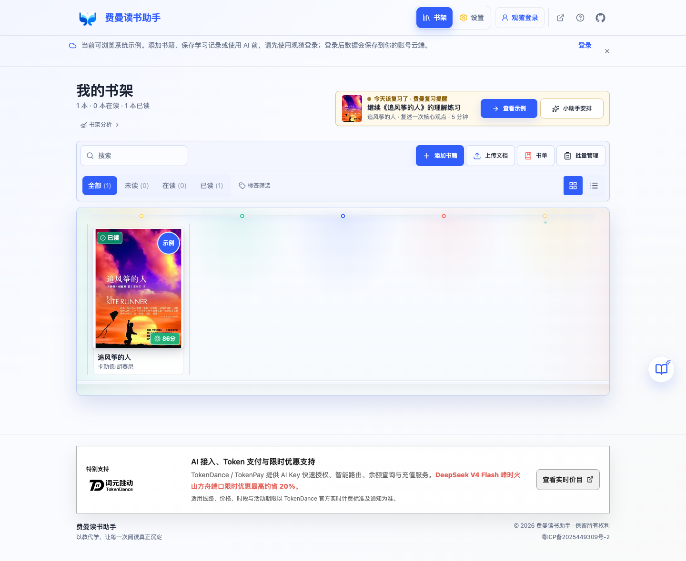
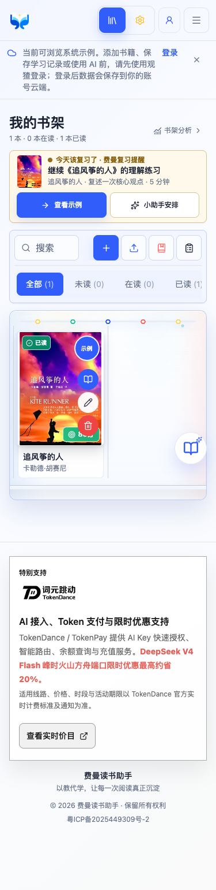

# Feynman Reader

<p align="center">
  
</p>


[Personal site](https://www.deline.top) · [Open Feynman Reader](https://reader.deline.top/) · [中文 README](README.md) · [Issues](https://github.com/HachikoJ/Feynman-Reader/issues)

**Reading is not understanding until you can explain it.**

Feynman Reader is an AI-assisted deep-reading workspace based on the Feynman technique. Instead of returning a passive summary, it asks you to teach the book in your own words, evaluates the explanation, and follows up from three different perspectives.

## What It Does

- Starts with a complete, no-setup sample workspace for *The Kite Runner*.
- Guides each book through six sequential learning phases.
- Stores teaching attempts, four-dimension scores, role-based questions, and revisions.
- Supports PDF, Word, Excel, and text document input.
- Works local-first with optional cloud storage: books, notes, and settings stay in IndexedDB when signed out, and can be imported to the user's private Supabase data after Watcha sign-in.
- Recommends TokenDance / TokenPay OAuth or API key setup for model access. DeepSeek's direct configuration channel is scheduled to retire on October 1, 2026; existing direct keys will no longer be supported after that date.

## Preview

<p></p>
<p></p>

## Quick Start

Requirements: Node.js 20 and npm.

```bash
npm ci
npm run dev
```

Open <http://localhost:8080>. You can inspect the sample book without an API key. To call AI, open Settings, configure TokenDance / TokenPay, read the privacy policy to the end, and confirm AI data transfer consent.

## Privacy, Cost, and Model Limits

Signed-out data stays in the browser; after Watcha sign-in, users can import it to private Supabase storage and view account-scoped statistics. Clearing browser data can still delete local records, so export backups when prompted. API keys are encrypted server-side and never displayed in full.

According to TokenDance's official clarification, `v4flash0731` offers limited-time savings of up to about 20% on the Volcengine Ark route at peak hours, and users can set route preferences in TokenDance. Actual prices, eligible routes, periods, and offer dates follow [TokenDance live pricing](https://tokendance.space/models/deepseek-v4-flash-0731) and subsequent notices. Model charges vary with input size and usage. AI analysis, scores, and suggestions are learning aids and are not guaranteed to be factually correct; verify important claims against the original book and your own judgment.

## Development Checks

```bash
npx tsc --noEmit
npm test -- --runInBand
npm run build
npm audit --omit=dev --audit-level=high
git diff --check
```

## Documentation

- [Product materials](docs/product/submission/README.md)
- [Privacy policy](https://reader.deline.top/privacy/)
- [Contributing](CONTRIBUTING.md)
- [Security policy](SECURITY.md)

## Project Status

This is an actively maintained personal project becoming a public product. Voice input, OCR, cloud sync, and automated review scheduling are not part of the current release.

## License

[MIT License](LICENSE)

## Star History

[](https://star-history.com/#HachikoJ/Feynman-Reader&Date)

## Contact

- GitHub: [HachikoJ](https://github.com/HachikoJ)
- Email: 946106011@qq.com
