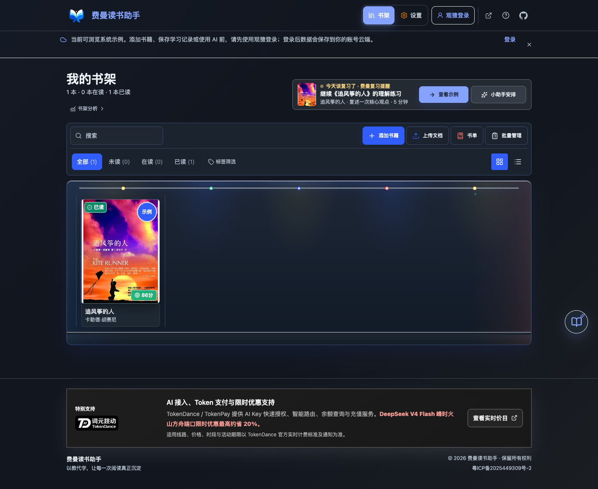
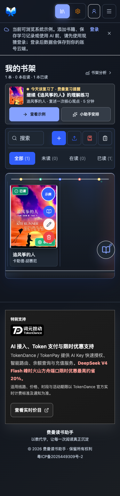

# Feynman Reader

<p align="center">
  
</p>


[](https://github.com/HachikoJ/Feynman-Reader)

[Personal site](https://www.deline.top) · [Open Feynman Reader](https://reader.deline.top/) · [中文 README](README.md) · [Issues](https://github.com/HachikoJ/Feynman-Reader/issues)

**Reading is not understanding until you can explain it.**

Feynman Reader is an AI-assisted deep-reading workspace based on the Feynman technique. Instead of returning a passive summary, it asks you to teach the book in your own words, evaluates the explanation, and follows up from three different perspectives.

Current release: [v0.2.0](https://github.com/HachikoJ/Feynman-Reader/releases/tag/v0.2.0). See the [version and recovery guide](docs/operations/releases-and-rollback.md) for immutable tags, source checksums, deployment identification, and rollback boundaries.

## What It Does

- Starts with a complete, no-setup sample workspace for *The Kite Runner*.
- Guides each book through six sequential learning phases.
- Stores teaching attempts, four-dimension scores, role-based questions, and revisions.
- Supports PDF, Word, Excel, and text document input.
- Lets signed-out visitors browse the system sample. Personal data is saved to the signed-in account's PostgreSQL database. Username/password accounts are temporary during ICP review; after approval, Watcha becomes the only sign-in method and users can merge one temporary account into their Watcha account before the old credentials are permanently disabled.
- Uses a separately configured TokenDance API key and AI data transfer consent for model access. The key is encrypted on the server and excluded from exports.

## Preview

<p></p>
<p></p>
<p></p>
<p></p>

The Account Center preview uses clearly labeled mock data and contains no real user information.

<details>
<summary>Dark mode: review cards and theme-aware TokenDance branding</summary>


</details>

## Quick Start

Requirements: Node.js 20.9 or later and npm. Production uses Node.js 22.

```bash
npm ci
npm run dev
```

Open <http://localhost:8080>. You can inspect the system sample without signing in or configuring an API key. Sign in with Watcha before saving personal data, then open Settings to authorize or add a TokenDance API key and confirm task-relevant AI data transfer consent.

### Local Account Preview

The current Watcha client registers only the production callback at `https://reader.deline.top/api/auth/tokendance/callback`, so a localhost session cannot complete real Watcha authorization. To inspect Account Center locally, add this to the Git-ignored `.env.local` file:

```env
NEXT_PUBLIC_FEYNMAN_LOCAL_AUTH_BYPASS=true
```

Preview mode uses mock account data and disables cloud writes. Production builds ignore this switch. Validate real OAuth, session cookies, and PostgreSQL reads and writes only after deployment through the production domain. Keep the Client Secret, database password, and generated secrets in the server environment file; never expose them to browser code or GitHub.

AI and sign-in channels follow deployment flags. After ICP approval, production uses `FEYNMAN_WATCHA_OAUTH_ENABLED=true`, `FEYNMAN_TOKENDANCE_ENABLED=true`, and `FEYNMAN_DEEPSEEK_OFFICIAL_ENABLED=false`. Run a full deployment after changing these build-time flags. Keep credentials and connection strings outside Git.

### Administrator dashboard

Every deployment applies the administrator security and encrypted change archive migrations and verifies administrator bindings. The sole administrator is bound through server-only `FEYNMAN_ADMIN_USER_ID` and `FEYNMAN_ADMIN_PROVIDER_SUBJECT`; missing bindings deny access. Initial TOTP enrollment still requires one server-local `npm run bootstrap:admin` invocation. The `/admin` page requires the ordinary account session plus a six-digit TOTP code. Administrator sessions are separate, short-lived, revocable, and audited.

System administration includes aggregate metrics, user profiles, detailed browsing across 19 data tables, controlled editing/deletion, account disable/enable, and conflict-aware recovery. Passwords, API keys, TOTP secrets, and encrypted change snapshots are excluded from generic details. See [administrator security notes](docs/admin-dashboard.md) and [data administration](docs/operations/admin-data-browser.md).

## Privacy, Cost, and Model Limits

Signed-out visitors can inspect only the system sample. Legacy browser data from earlier releases can be imported after Watcha sign-in, after which personal records are stored in the account-scoped PostgreSQL database. API keys are encrypted server-side, excluded from exports, and never displayed in full.

According to TokenDance's official clarification, `v4flash0731` offers limited-time savings of up to about 20% on the Volcengine Ark route at peak hours, and users can set route preferences in TokenDance. Actual prices, eligible routes, periods, and offer dates follow [TokenDance live pricing](https://tokendance.space/models/deepseek-v4-flash-0731) and subsequent notices. Model charges vary with input size and usage. AI analysis, scores, and suggestions are learning aids and are not guaranteed to be factually correct; verify important claims against the original book and your own judgment.

## Development Checks

```bash
npx tsc --noEmit
npm run lint
npm test -- --runInBand
npm run build
npm audit --omit=dev --audit-level=high
git diff --check
```

## Documentation

- [Product materials](docs/product/submission/README.md)
- [Privacy policy](https://reader.deline.top/privacy/)
- [Changelog](CHANGELOG.md)
- [Version and recovery guide](docs/operations/releases-and-rollback.md)
- [Contributing](CONTRIBUTING.md)
- [Security policy](SECURITY.md)

## Project Status

This is an actively maintained public product. Voice input, OCR, and automated review scheduling are not part of the current release. Account-scoped storage requires a configured PostgreSQL database and Watcha OAuth credentials on the server.

## License

[MIT License](LICENSE)

## Star History

[](https://star-history.com/#HachikoJ/Feynman-Reader&Date)

## Contact

- GitHub: [HachikoJ](https://github.com/HachikoJ)
- Email: 946106011@qq.com
