# Feynman Reader

<a id="top"></a>

<p align="center"></p>


[](LICENSE)
[](https://github.com/HachikoJ/Feynman-Reader)

[Open Feynman Reader](https://reader.deline.top/) · [中文](README.md) · [Features](#features) · [Preview](#preview) · [How AI Works](#how-ai-works) · [Quick Start](#quick-start) · [Issues](https://github.com/HachikoJ/Feynman-Reader/issues)

**Reading is not understanding until you can explain it.**

Feynman Reader is an AI reading workspace built around the Feynman technique. Build a six-phase understanding of a book, teach it in your own words, and use feedback and questions from three roles to identify gaps. Notes, quotes, and the Feynman Assistant connect each practice session to future reading and review.

Product website: **[https://reader.deline.top/](https://reader.deline.top/)**. Current release: [v0.4.2](https://github.com/HachikoJ/Feynman-Reader/releases/tag/v0.4.2). [Changelog](CHANGELOG.md) · [Version and recovery guide](docs/operations/releases-and-rollback.md). Every deployment keeps its source on GitHub under a `deploy-` snapshot tag, for example [deploy-v0.4.0-a3b2ab0](https://github.com/HachikoJ/Feynman-Reader/releases/tag/deploy-v0.4.0-a3b2ab0).

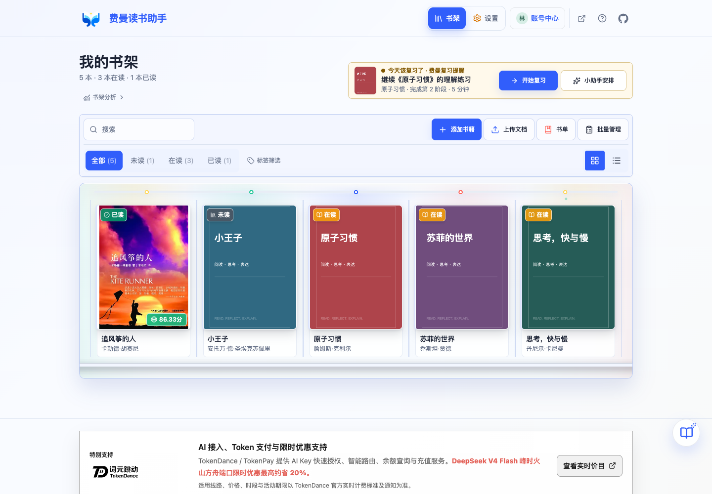

> Screenshots show the actual application with a fictional ordinary account, library, conversations, and scores. Some phase content comes from the public system sample. These contain no real user data and are not model benchmarks. Account Center images are updated to v0.2.2; the remaining images are from v0.2.1. See [original provenance](docs/product/screenshots/v0.2.1/README.md) and [this update](docs/product/screenshots/v0.2.2/README.md).

## Features

| Area | Current behavior |
| --- | --- |
| Books and documents | Create books, edit covers, organize tags and lists, or import EPUB, MOBI / AZW3, FB2, PDF, DOCX / DOC, HTML, RTF, TXT, Markdown, and JSON. EPUB and MOBI also fill in the title, author, cover, and chapters. |
| Source reading | Read the imported text chapter by chapter, adjust font size and theme, and highlight passages in four colours with notes and tags (up to 8 tags per highlight, 24 characters each, with suggestions from the tags already used in the book). Click an existing highlight to recolor it, edit its note, add or remove tags, or delete it. The toolbar also adds bookmarks per section, searches the whole book, and opens panels for contents, highlights, and bookmarks; the highlights panel filters by chapter and tag, and arrow keys move between sections. Highlights keep their chapter source and character offset so Feynman practice and AI review can check them against the original text; the Notes tab aggregates both highlights and bookmarks and filters notes by source (highlight, imported, manual) and tag. |
| Highlight import | Use the official Readwise and Zotero APIs, or import official export text from WeChat Reading, Kindle, Apple Books, and similar apps. No cookie scraping or reverse-engineered integrations. |
| Six learning phases | Explore background, overview, deep analysis, critical thinking, reception, and synthesis. Confirm each phase as complete to unlock the next. |
| Teaching practice | Write an explanation of 200–20,000 characters. Review accuracy, completeness, clarity, overall score, original text, and feedback. |
| Three-role Q&A | After passing teaching, use the default roles, a preset, or choose three roles yourself. Answer, evaluate, and retry individual questions. |
| Notes and review | Keep notes, quotes, and practice history. Bookshelf suggestions consider weak areas, unfinished work, and activity history. |
| Feynman Assistant | Multiple conversations, book references, attachments, edit and resend, conversation branches, copy, Word export, and selection-to-quote saving. |
| Account Center | Manage your profile, library, quotes, and assistant sessions; review learning statistics and activity, manage preferences, and organize records with import/export and the recycle bin. |

Explore the *Kite Runner* sample to try the complete learning flow, then sign in with **【观猹】 (Watcha)** to begin your own reading and practice. Before using AI, connect TokenDance in Settings and review and accept the relevant data-use notice.

## Preview

### Six-Phase Reading

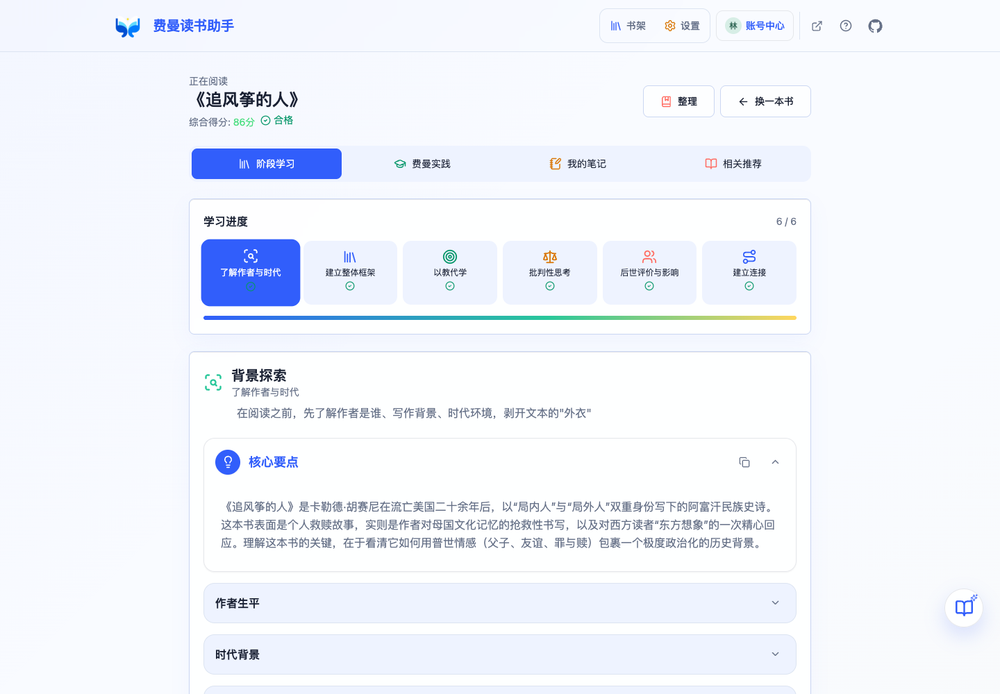

Source reading, phase learning, teaching practice, notes, and recommendations are five views of the same book. Analyses can be expanded or collapsed. Generating an analysis does not automatically mark its phase as complete.

### Teaching and Role Questions

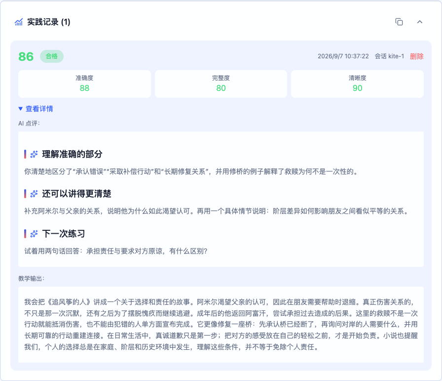

<details>
<summary>Teaching input and all three role questions</summary>

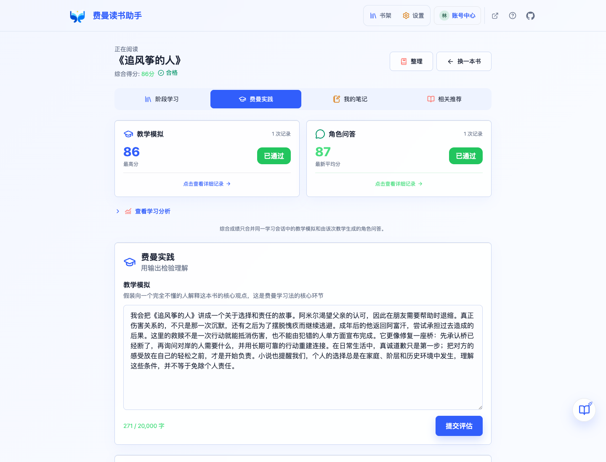

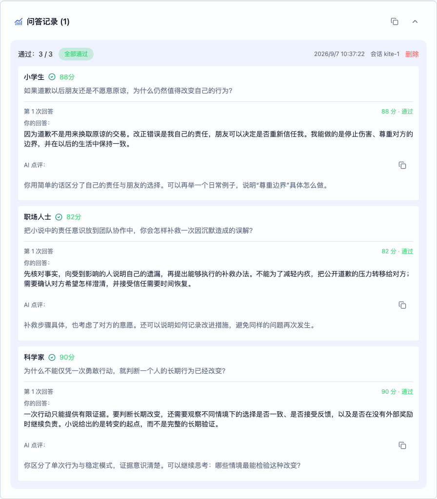

</details>

### Feynman Assistant

<p>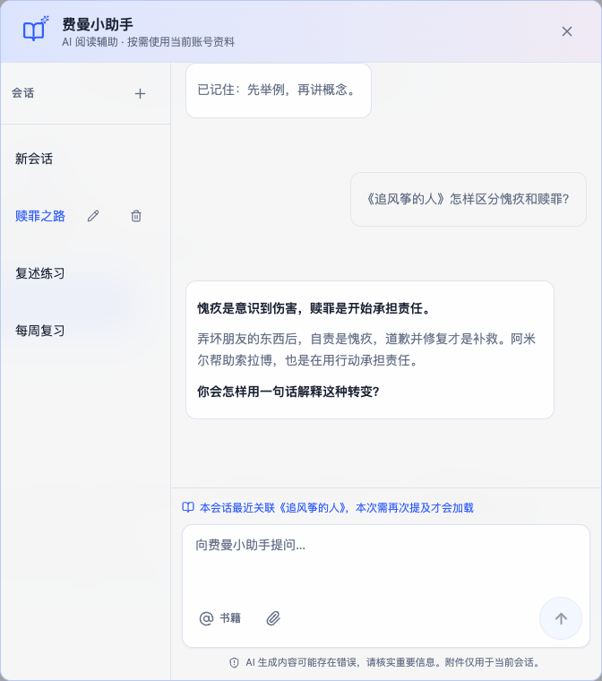</p>

Continue a discussion using relevant material from your account. Switch sessions, reference a book, or attach source material. Explicit Chinese requests such as “记住” can save learning preferences; Account Center provides memory controls and export. Automatic extraction of equivalent English requests is not currently implemented.

<details>
<summary>Mobile bookshelf, assistant, and Account Center</summary>

<p>
  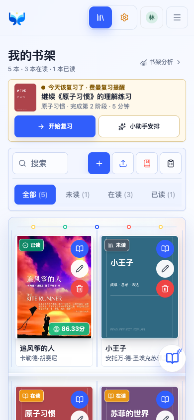
  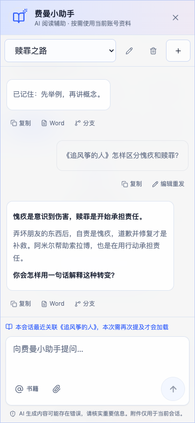
  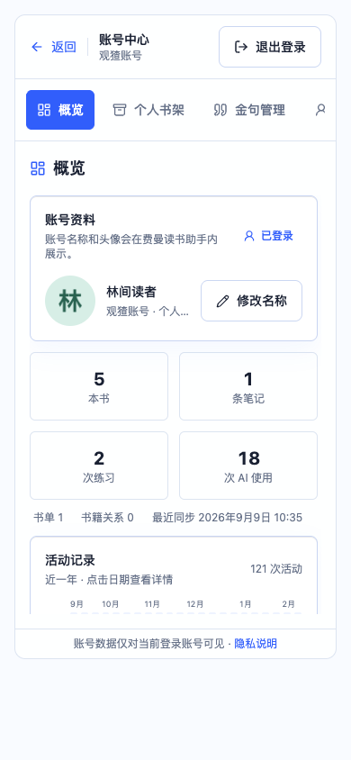
</p>

</details>

### Account Center and Dark Mode

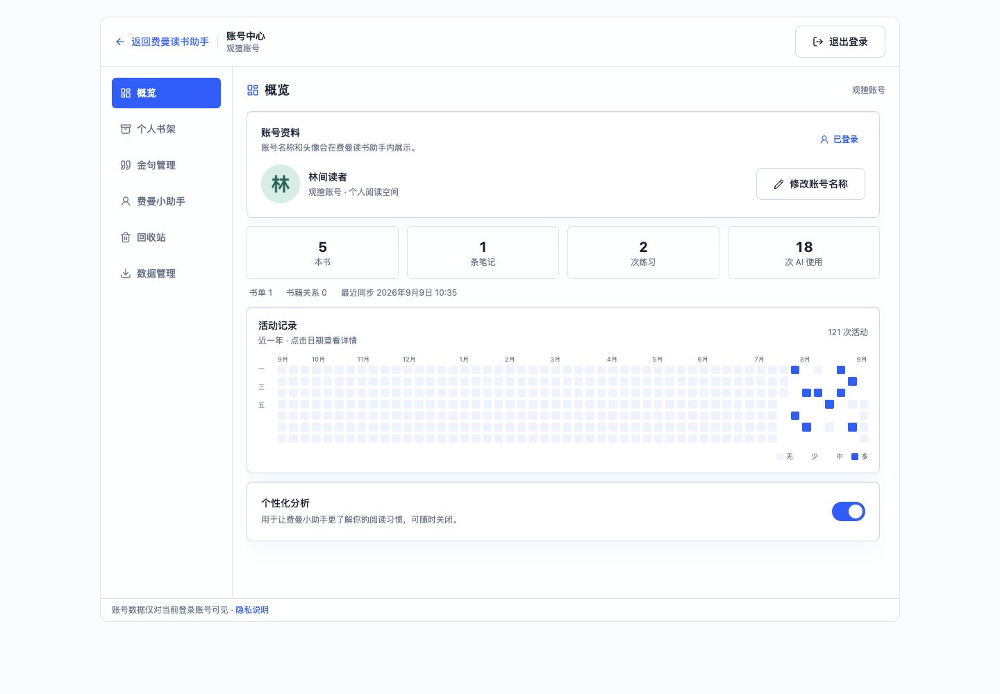

<details>
<summary>Dark bookshelf and theme-aware TokenDance branding</summary>

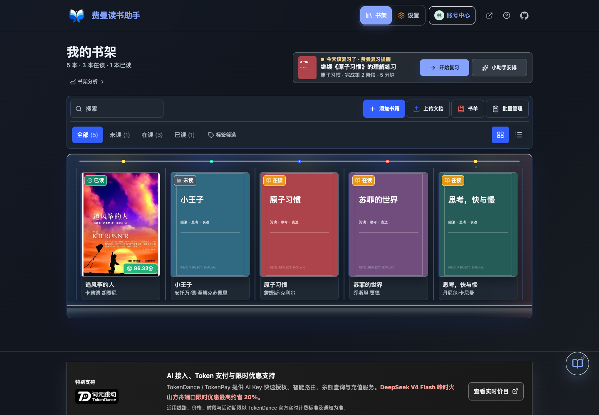

</details>

## Core Interaction

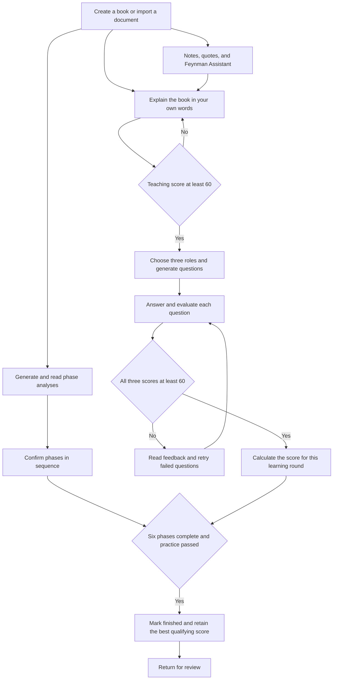

Teaching and Q&A must belong to the **same learning round**. A qualifying round's score averages the teaching overall score and the mean of its three question scores. Every question must pass; a high score elsewhere cannot compensate for a failed answer. A book is marked finished only after all six phases are complete and practice qualifies. Practice, notes, and the assistant can be used during reading.

## How AI Works

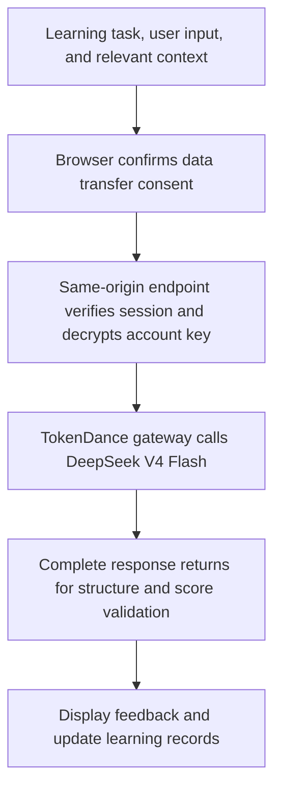

Production uses `deepseek-v4-flash-0731` through TokenDance. The browser calls `/api/ai/chat/completions/`; the server decrypts the current account's key and forwards the request. Responses are non-streaming. Direct official DeepSeek access remains an optional deployment channel, disabled in current production.

| Task | Context and boundaries |
| --- | --- |
| Phase analysis | Book metadata, phase instructions, and available document excerpts. Context is selected within length limits; the full source is not necessarily sent. |
| Teaching and Q&A | The explanation, selected roles, and the current round's questions and answers. The model proposes scores; application rules validate them and enforce round matching and completion. |
| Assistant | Relevant books, learning records, quotes, prior sessions, and enabled preferences from the current account. Recent book summaries can be used when no specific book matches. Context length is bounded. |
| Attachments and memory | Up to five assistant attachments, at most 12,000 characters each and 30,000 total. Preferences require an explicit request and a successful save; users can manage or disable them. |

The assistant has no web search, code execution, or autonomous action tools. Analysis and feedback are learning aids, not guarantees of factual correctness. Check important claims against the original book and your own judgment.

## Quick Start

Requirements: Node.js 20.9 or later and npm. Production uses Node.js 22.

```bash
npm ci
npm run dev
```

Open [http://localhost:8080](http://localhost:8080) to explore the sample. Full account storage requires PostgreSQL, OAuth, and server secrets described in [.env.example](.env.example). Never commit real credentials.

### Local Preview

The production OAuth callback is `https://reader.deline.top/api/auth/tokendance/callback` and cannot directly authorize localhost. With Watcha disabled, `NEXT_PUBLIC_FEYNMAN_LOCAL_AUTH_BYPASS=true` in `.env.local` enables browser-local storage and displays a mock Account Center when signed out. Mock account actions do not write to the cloud.

**Production builds do not automatically ignore this switch.** Explicitly disable it for deployment. Validate real OAuth and database access using registered callbacks and server configuration.

### Production

The current deployment uses Tencent Cloud, PostgreSQL, Next.js standalone, PM2, and an Nginx HTTPS proxy. Configure the server-only `/etc/feynman-reader.env` using [.env.example](.env.example), then build and deploy through `deploy.sh`. Key settings:

```env
TOKENDANCE_OAUTH_REDIRECT_URI=https://reader.deline.top/api/auth/tokendance/callback
FEYNMAN_COOKIE_SECURE=true
FEYNMAN_WATCHA_OAUTH_ENABLED=true
FEYNMAN_TOKENDANCE_ENABLED=true
FEYNMAN_DEEPSEEK_OFFICIAL_ENABLED=false
NEXT_PUBLIC_FEYNMAN_LOCAL_AUTH_BYPASS=false
```

Deployment synchronizes the public build flags; rebuild after changes. The website and OAuth callback use `reader.deline.top`, while the registered TokenDance attribution header `X-App-URL` remains `https://www.deline.top`. These serve different purposes.

Follow the [version and recovery guide](docs/operations/releases-and-rollback.md) for immutable tags, source checksums, and deployment records. Application rollback and database recovery are separate operations; existing learning data must not be overwritten merely to restore an application version.

## Data, Costs, and Limits

- Your library, notes, and practice records belong to your account. View and manage them in Account Center, with import, export, and a recycle bin to organize your learning material.
- Saved account API keys are encrypted on the server; their plaintext is not returned to the browser or included in learning data exports. AI requests require consent to transfer relevant content.
- Book documents support PDF, DOCX / DOC (Word 97-2003 binary, parsed in-app with a built-in OLE reader), TXT, Markdown, and JSON: up to 20 MB, 1,000 PDF pages, and one million parsed characters. PDFs preflight at most four representative pages for a text layer; scan-only PDFs fail quickly without automatic OCR. Excel, scanned/archive formats such as DJVU, CHM, and CBZ, and image OCR are unsupported.
- Model costs vary with input, output, and route. Consult [TokenDance live pricing](https://tokendance.space/models/deepseek-v4-flash-0731); temporary offers are not permanent pricing promises.
- Review suggestion cards are implemented. Voice transcription, OCR, fixed D1/D7/D21 schedules, and automatic reminders are not. The learning flow uses six sequential phases.

## Stack and Documentation

| Layer | Implementation |
| --- | --- |
| UI | Next.js 16, React, TypeScript, Tailwind CSS |
| AI | TokenDance OpenAI-compatible gateway, DeepSeek V4 Flash |
| Data | PostgreSQL, account sessions, server-side key encryption |
| Documents | PDF.js, Mammoth, text parsing |
| Validation | Jest, Playwright, TypeScript, ESLint |

- [Changelog](CHANGELOG.md) and [version and recovery guide](docs/operations/releases-and-rollback.md)
- [Contributing](CONTRIBUTING.md) and [security reporting](SECURITY.md)
- [Privacy policy](https://reader.deline.top/privacy/)
- [Historical product and submission materials](docs/product/submission/README.md): early design context; this README and release notes describe current behavior.

Development checks:

```bash
npx tsc --noEmit
npm run lint
npm test -- --runInBand
npm run build
git diff --check
```

## Maintenance and Contributions

Maintained by [HachikoJ](https://github.com/HachikoJ). Current AI development collaboration: **OpenAI Codex**, assisting with implementation, debugging, testing, and documentation. Feedback and improvements are welcome through [Issues](https://github.com/HachikoJ/Feynman-Reader/issues) and pull requests.

GitHub's automatic [Contributors](https://github.com/HachikoJ/Feynman-Reader/graphs/contributors) view derives from commit history and co-author trailers. It may include historical collaboration and is not a list of current maintainers.

## License and Contact

[MIT License](LICENSE). Retain the original copyright and license notices when using, modifying, or distributing the project.

- GitHub: [HachikoJ](https://github.com/HachikoJ)
- Email: `946106011@qq.com`
- WeChat: `hostrow` (mention `费曼读书`)
- [Community and support QR codes](README.md#联系与交流)

## Star History

[](https://star-history.com/#HachikoJ/Feynman-Reader&Date)

[Back to top](#top)
