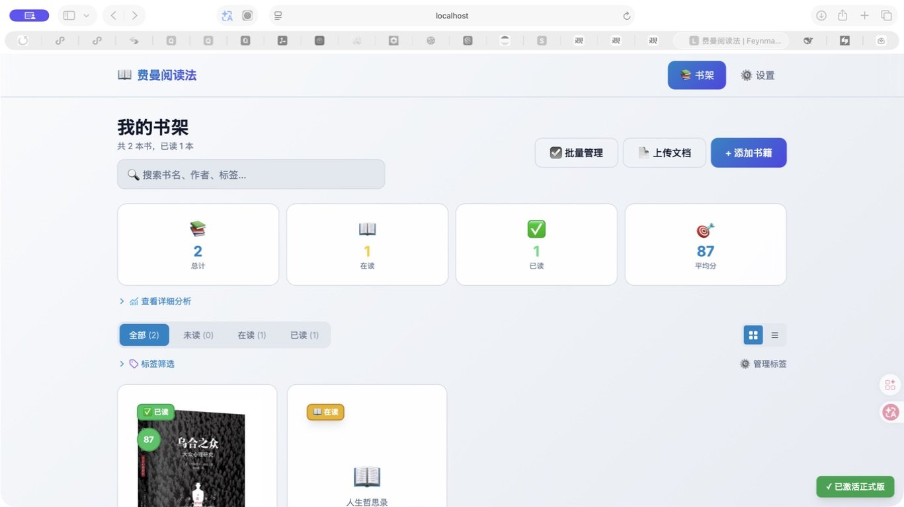
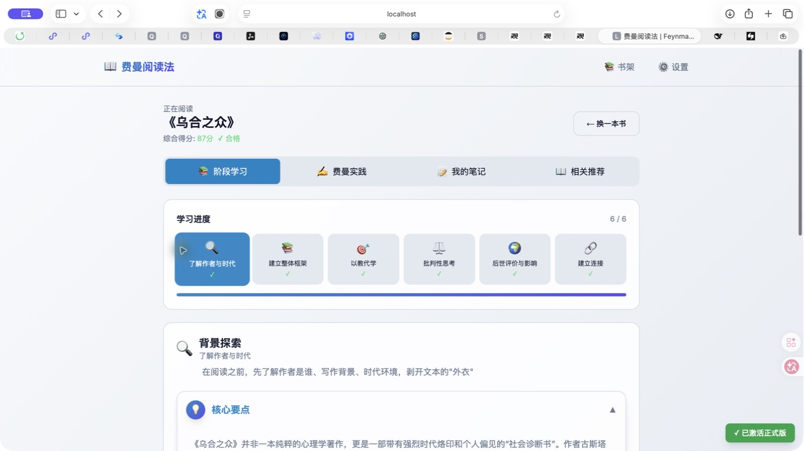
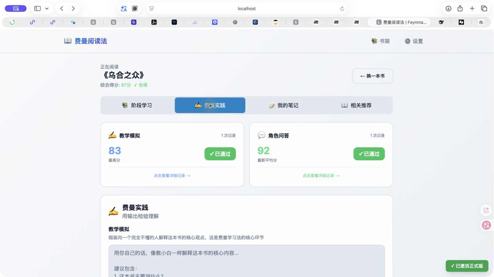
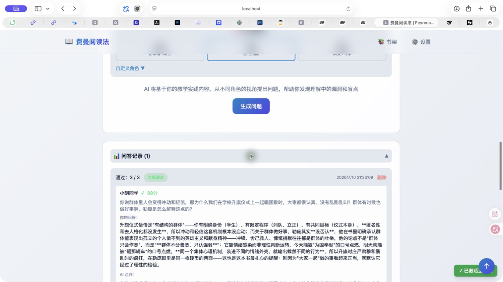
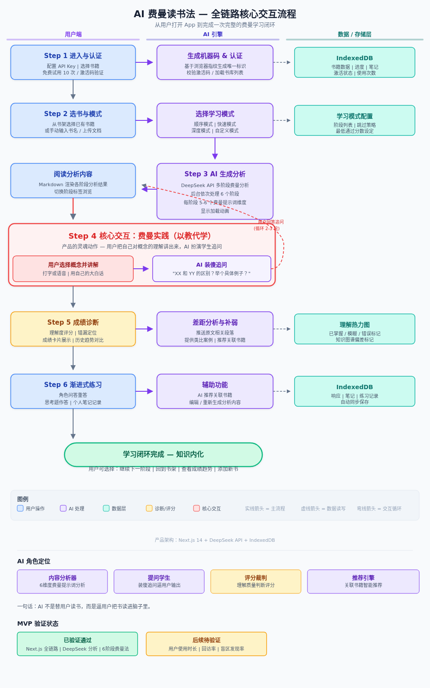

# AI 费曼读书助手 - Feynman Reader


[为什么做这个](#为什么做这个) · [核心体验](#核心体验) · [Demo 预览](#demo-预览) · [如何运行](#如何运行) · [项目资料](#项目资料) · [联系作者](#联系作者)

**读完不算懂，能讲清楚才算。**

AI 费曼读书助手不是再帮你总结一本书，而是让你把书里的内容讲给 AI 听。AI 会先看你的解释，再从 3 个不同角色的角度追问你，直到你真的知道自己哪里没懂、该怎么改。

> [!IMPORTANT]
> **这是一个本地优先的学习 Demo。** 学习记录和 API Key 默认保存在用户自己的浏览器里；调用 AI 前，需要先阅读并同意隐私政策。当前使用用户自己的 DeepSeek API Key，不是平台代付的无限 AI 服务。

## GitHub 传播素材

- 一句话简介：把一本书讲给 AI 听，直到 3 个角色都问不倒你。
- 项目短描述：一个基于费曼学习法的 AI 深度阅读工具，包含六阶段学习、教学模拟、严格评分和 3 角色追问。
- 建议 Topics：`ai-learning`、`feynman-technique`、`deepseek`、`nextjs`、`learning-tool`、`critical-thinking`、`readwise`
- 演示素材：真实 Safari 截图、核心流程图和完整录屏均随 DemoDay 提交材料整理。

## 为什么做这个

我以前读技术书时经常有一种错觉：看懂了，划线也划了，笔记也记了。可一旦有人问“这本书到底讲了什么”，脑子会突然卡住。

后来我接触到费曼学习法，里面最打动我的一句话是：**如果不能用简单的话解释，就不算真的理解。**

但自己练的时候有两个问题：没有人逼你讲，也没有人告诉你哪里讲错了。所以我想做一个“装傻但懂行”的 AI 陪练。它不直接替用户想答案，而是把用户推回自己的表达里。

## 核心体验

### 1. 先建立阅读框架

用户可以创建书籍或上传 PDF、Word、Excel 文档。AI 会从背景探索、全书概览、深度拆解、辩证分析、众声回响、融会贯通六个阶段，帮用户建立阅读框架。

### 2. 用自己的话教给 AI

用户需要像给小白上课一样，用至少 200 字解释这本书。AI 会从准确度、完整度、清晰度和综合表现四个维度评分，并明确指出哪里讲清楚了、哪里还不够。

### 3. 接受 3 个角色追问

教学模拟后，AI 会生成固定 3 个不同角色的问题，例如小学生、职场新人、研究者或批评者。每题单独评分，没通过的回答和改进建议都会保留，用户可以只重答这一题。

### 4. 不让平均分掩盖没学会

只有教学模拟达到练习要求，并且 3 个角色问题全部达到 60 分，这本书才会进入“已读”并计算综合得分。这里想解决的是一个很简单的问题：不能因为前面答得不错，就把后面的漏洞平均掉。

## Demo 预览

### 书架与学习状态

<p>
  
</p>

书架展示在读/已读状态、阶段进度、综合得分、标签筛选和阅读分析。示例数据使用《乌合之众》，用于演示深度阅读的完整流程。

### 六阶段阅读

<p>
  
</p>

每个阶段的内容可以折叠查看，用户不需要一开始被长文淹没，需要时再展开原理、背景和思考角度。

### 教学模拟与角色问答

<p>
  
</p>

<p>
  
</p>

AI 的作用不是给出“你很棒”的空泛鼓励，而是保留原回答、具体得分和改进方向，让用户知道自己下一次应该怎么讲。

### 核心交互流程

<p>
  
</p>

```text
书籍 / 本地文档
  -> 六阶段学习
  -> 用户教学模拟
  -> AI 评分和反馈
  -> 3 个角色追问
  -> 用户逐题重答
  -> 全部通过后更新已读状态和综合得分
```

## AI 怎么工作


| 用户负责 | AI 负责 |
| --- | --- |
| 读书、选择概念、用自己的话解释、决定是否重答 | 生成阶段分析、提出追问、评分并给出改进建议 |
| 保持自己的判断，形成最终理解 | 找出表达中的漏洞，而不是替用户宣布“已经学会” |

## 当前已实现

- 书架管理：创建、编辑、删除、搜索、标签筛选、阅读统计。
- 文档输入：PDF、Word、Excel 内容解析，并作为 AI 分析的参考。
- 六阶段学习：按顺序完成背景、框架、拆解、批判、评价和连接。
- 教学模拟：至少 200 字的个人解释、四维度评分、历史记录。
- 角色问答：固定 3 题、逐题评分、原回答和改进建议、单题重答。
- 本地优先：书籍、设置和学习记录默认保存到 IndexedDB；API Key 默认掩码展示。
- 隐私同意：保存 Key 和调用 AI 前都需要确认数据传输同意，并强制阅读隐私政策到底部。

## 如何运行

```bash
npm install
npm run dev
```

打开 [http://localhost:8080](http://localhost:8080)。第一次使用时：

1. 在设置中填写自己的 DeepSeek API Key。
2. 阅读隐私政策，滚动到底部后勾选同意。
3. 创建一本书或上传资料，开始第一次“讲给 AI 听”的练习。

## 技术栈

- **前端**：Next.js 14、TypeScript、Tailwind CSS
- **AI**：DeepSeek API
- **本地数据**：IndexedDB
- **文档解析**：PDF.js、Mammoth、XLSX
- **测试**：Jest、Playwright

## 项目资料

- [产品方案](docs/demoday/submission/Product_Plan_ZH.md)：需求来源、用户、核心流程、产品边界和复盘。
- [AI 工作流程](docs/demoday/submission/AI_Workflow_ZH.md)：模型与规则如何分工，以及数据边界。
- [Demo 说明](docs/demoday/submission/Demo_Guide_ZH.md)：建议演示路径、真实 Safari 截图索引和功能边界。
- [增长方案](docs/demoday/submission/Growth_Plan_ZH.md)：增长策略、定价、Token 成本控制与 PMF 验证。

## 还没做，但下一步想做

- 语音输入和转写，让“讲给 AI 听”更自然。
- D1/D7/D21 的复习队列和提醒，让用户回来重讲薄弱点。
- 把目前的浏览器端试用和激活迁移到服务端，提供更可靠的授权和 Token 配额。
- 用真实用户测试：他们愿不愿意讲、会不会重答、7 天后还会不会回来。

## 边界说明

这个项目不是自动读书机，也不应该替用户完成思考。当前版本不支持语音输入、OCR 拍书、可实际触发的遗忘曲线提醒；学习模式配置也还没有接入主流程。

本地试用与激活仅用于 Demo 展示，不能当作生产级安全方案。若产品正式上线，API 调用、授权、配额和风控都需要迁移到服务端。

## 更新记录

### 2026-07-11

- 完善角色问答：统一为 3 个角色，逐题保留未通过回答和改进建议。
- 修复学习完成判断：3 题没有全部通过时，不计算综合得分或标记为已读。
- 优化隐私同意、设置布局、密钥显示、数据管理和 Markdown 渲染体验。
- 补充真实 Safari 截图、交互流程图和产品演示视频。

## 联系作者

想交流产品、反馈问题或获取激活码，可以联系：

- 微信：`hostrow`（备注 `费曼阅读法`）
- 隐私政策邮箱：`18682408521@163.com`

---

如果你也有一本“读完觉得懂了，但讲不清楚”的书，试着先讲给 AI 听一次。
