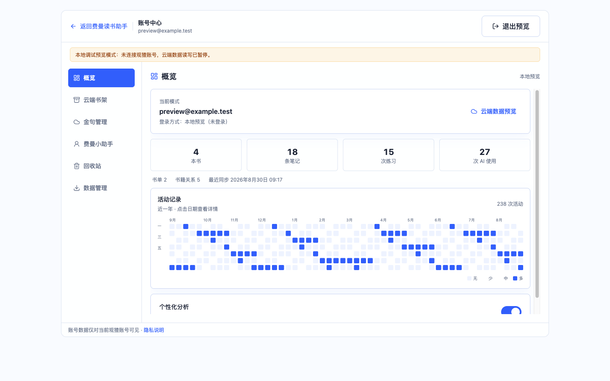
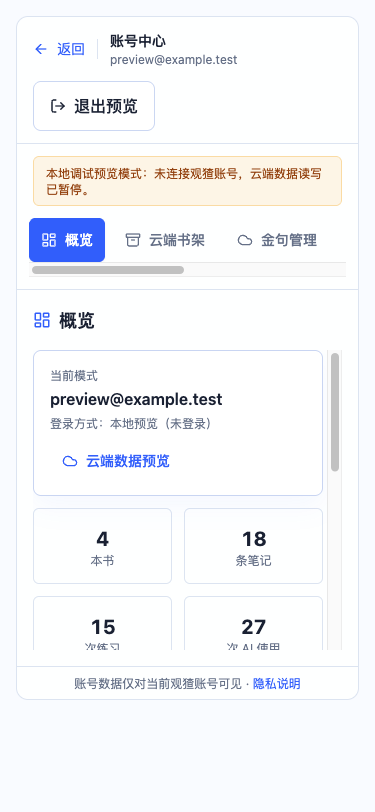
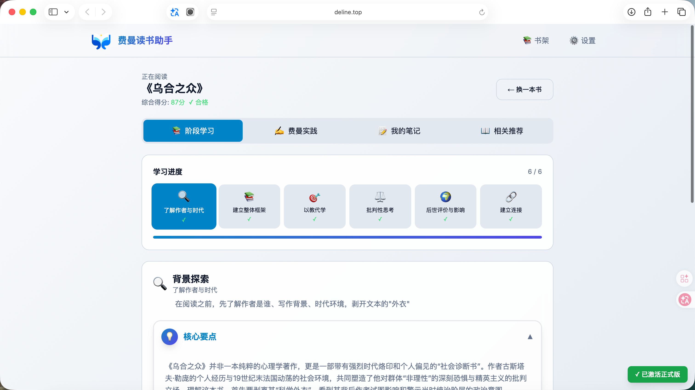
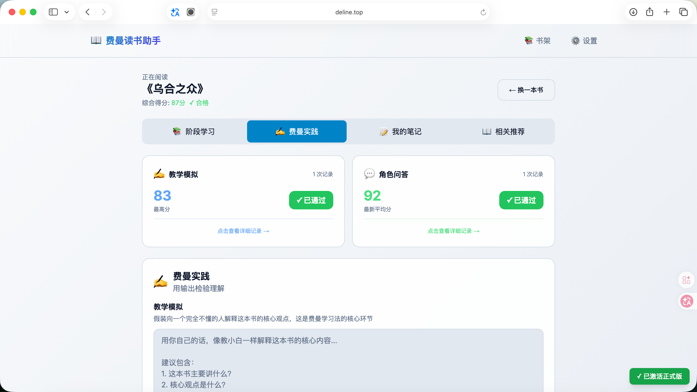
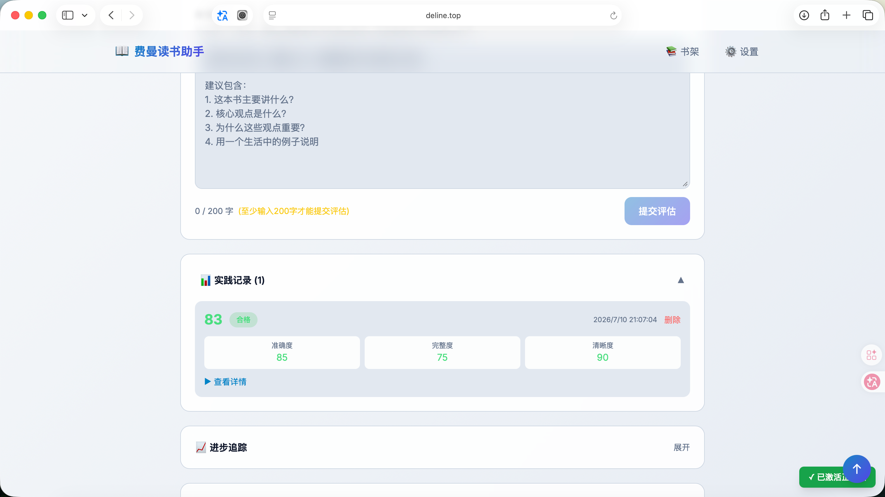
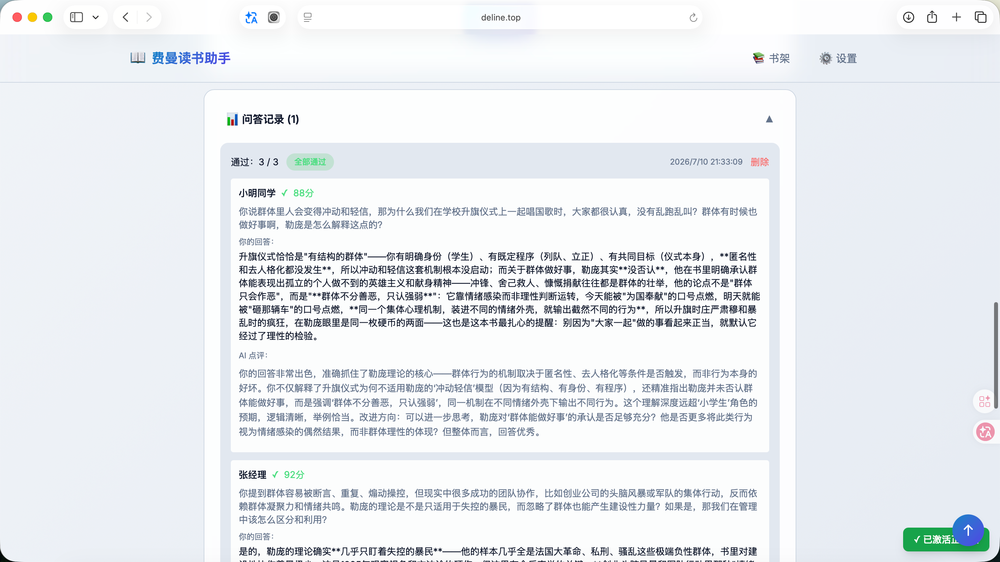
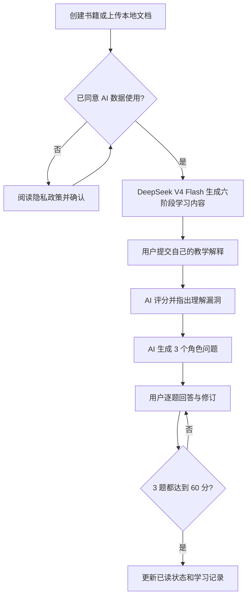

# 费曼读书助手 - Feynman Reader

<p align="center">
  
</p>


[English](README.en.md) · [个人官网](https://www.deline.top) · [进入费曼读书助手](https://reader.deline.top/) · [为什么做这个](#为什么做这个) · [核心体验](#核心体验) · [产品预览](#产品预览) · [如何运行](#如何运行) · [项目资料](#项目资料) · [联系作者](#联系作者)

**读完不算懂，能讲清楚才算。**

费曼读书助手不是再帮你总结一本书，而是让你把书里的内容讲给 AI 听。AI 会先看你的解释，再从 3 个不同角色的角度追问你，直到你真的知道自己哪里没懂、该怎么改。

**产品访问：** [https://reader.deline.top/](https://reader.deline.top/)

> [!IMPORTANT]
> **这是一个登录后使用账号云端的学习产品。** 未登录时可以浏览系统示例；添加书籍、AI 分析和保存学习记录前，需要先使用观猹登录。登录后，书籍、笔记、金句、助手会话和长期记忆会保存到账号对应的 PostgreSQL 云端数据库。IndexedDB 只用于老用户一次性历史迁移。TokenDance API Key 由服务端加密保存，不会显示明文，也不会进入备份文件。

## GitHub 传播素材

- 一句话简介：把一本书讲给 AI 听，直到 3 个角色都问不倒你。
- 项目短描述：一个基于费曼学习法的 AI 深度阅读工具，包含六阶段学习、教学模拟、严格评分和 3 角色追问。
- 建议 Topics：`ai-learning`、`feynman-technique`、`deepseek`、`nextjs`、`learning-tool`、`critical-thinking`、`readwise`
- 产品素材：真实 Safari 截图、核心流程图和完整录屏均已整理归档。

[](https://github.com/HachikoJ/Feynman-Reader)

## 为什么做这个

我以前读技术书时经常有一种错觉：看懂了，划线也划了，笔记也记了。可一旦有人问“这本书到底讲了什么”，脑子会突然卡住。

后来我接触到费曼学习法，里面最打动我的一句话是：**如果不能用简单的话解释，就不算真的理解。**

但自己练的时候有两个问题：没有人逼你讲，也没有人告诉你哪里讲错了。所以我想做一个“装傻但懂行”的 AI 陪练。它不直接替用户想答案，而是把用户推回自己的表达里。

## 核心体验

### 1. 先建立阅读框架

用户可以创建书籍或上传 PDF、Word、Excel 文档。AI 会从背景探索、全书概览、深度拆解、辩证分析、众声回响、融会贯通六个阶段，帮用户建立阅读框架。

### 2. 用自己的话教给 AI

用户需要像给小白上课一样，用至少 200 字解释这本书。AI 会从准确度、完整度、清晰度和综合表现四个维度评分，并明确指出哪里讲清楚了、哪里还不够。

### 3. 接受 3 个角色追问

教学模拟后，AI 会从不同类型中随机选择 3 个角色提问，例如初学者、同行者、专家或批评者。每题单独评分，没通过的回答和改进建议都会保留，用户可以只重答这一题。

### 4. 不让平均分掩盖没学会

只有教学模拟达到练习要求，并且 3 个角色问题全部达到 60 分，这本书才会进入“已读”并计算综合得分。这里想解决的是一个很简单的问题：不能因为前面答得不错，就把后面的漏洞平均掉。

## 产品预览

### 书架与学习状态

<p>
  
</p>

<p>
  
</p>

书架展示在读/已读状态、阶段进度、综合得分、标签筛选和阅读分析。示例数据使用《追风筝的人》，完整呈现深度阅读流程。

### 账号云端

<p>
  
</p>

<p>
  
</p>

账号中心集中管理云端书架、金句、费曼小助手会话、回收站和数据导入导出。截图使用明确标注的本地预览数据，不包含真实用户信息。

### 六阶段阅读

<p>
  
</p>

每个阶段的内容可以折叠查看，用户不需要一开始被长文淹没，需要时再展开原理、背景和思考角度。

### 教学模拟与角色问答

<p>
  
</p>

<p>
  
</p>

<p>
  
</p>

AI 的作用不是给出“你很棒”的空泛鼓励，而是保留原回答、具体得分和改进方向，让用户知道自己下一次应该怎么讲。

### 设置与隐私

登录后的学习记录保存到账号对应的 PostgreSQL 云端数据库；TokenDance API Key 由服务端加密保存且不进入数据导出。用户在调用 AI 前仍需完成数据传输同意，并可在账号中心管理或导出自己的云端数据。

### 核心交互流程

<p>
  
</p>

```text
书籍 / 本地文档
  -> 六阶段学习
  -> 用户教学模拟
  -> AI 评分和反馈
  -> 3 个角色追问
  -> 用户逐题重答
  -> 全部通过后更新已读状态和综合得分
```

## AI 怎么工作



| 用户负责 | AI 负责 |
| --- | --- |
| 读书、选择概念、用自己的话解释、决定是否重答 | 生成阶段分析、提出追问、评分并给出改进建议 |
| 保持自己的判断，形成最终理解 | 找出表达中的漏洞，而不是替用户宣布“已经学会” |

## 当前已实现

- 书架管理：创建、编辑、删除、搜索、标签筛选、阅读统计。
- 文档输入：PDF、Word、Excel 内容解析，并作为 AI 分析的参考。
- 六阶段学习：按顺序完成背景、框架、拆解、批判、评价和连接。
- 教学模拟：至少 200 字的个人解释、四维度评分、历史记录。
- 角色问答：固定 3 题、逐题评分、原回答和改进建议、单题重答。
- 账号云端：未登录可浏览系统示例；个人书籍、学习记录、金句和助手数据在当前登录账号下保存到 PostgreSQL。备案期间临时开放用户名密码账号；域名审核通过后仅保留观猹登录，用户可在账号中心一次性合并原账号，合并后原账号永久停用。IndexedDB 只用于老用户历史迁移，API Key 只在服务端加密保存并始终掩码展示。
- 隐私同意：保存 Key 和调用 AI 前都需要确认数据传输同意，并强制阅读隐私政策到底部。

## 如何运行

```bash
npm install
npm run dev
```

打开 [http://localhost:8080](http://localhost:8080)。第一次使用时：

1. 浏览系统示例；需要保存个人数据时，使用观猹登录。
2. 在设置中授权或填写 TokenDance API Key，并同意当前 AI 任务所需的数据传输。
3. 创建一本书或上传资料，开始第一次“讲给 AI 听”的练习；数据会自动保存到当前账号云端。

### 本地账号中心预览

当前观猹客户端只登记正式回调地址 `https://reader.deline.top/api/auth/tokendance/callback`，因此 `localhost` 不能完成真实观猹授权。本地调试账号中心时，可在已被 Git 忽略的 `.env.local` 中启用只读预览：

```env
NEXT_PUBLIC_FEYNMAN_LOCAL_AUTH_BYPASS=true
```

预览模式只展示 Mock 账号与示例云端数据，并禁用云端写入；生产构建会忽略该开关。真实 OAuth、会话 Cookie 和 PostgreSQL 读写必须部署后通过正式域名验证。Client Secret、数据库密码和随机密钥只能放在服务器环境文件中，不能写入前端代码或提交到 GitHub。

### 生产部署（腾讯云 + PostgreSQL）

生产环境由 `deploy.sh` 构建 Next.js standalone 服务，并通过 PM2 监听 `127.0.0.1:8080`；Nginx 负责 `https://reader.deline.top` 的 HTTPS 反向代理。服务器只需要准备 `/etc/feynman-reader.env`（权限 `600`），填写 `.env.example` 中的生产值，尤其是 PostgreSQL 的 `DATABASE_URL` 和完全一致的回调地址：

```env
TOKENDANCE_OAUTH_REDIRECT_URI=https://reader.deline.top/api/auth/tokendance/callback
FEYNMAN_COOKIE_SECURE=true
FEYNMAN_WATCHA_OAUTH_ENABLED=false
```

如果使用远程 PostgreSQL，按编号执行适用的 schema 迁移；如果迁移到同一台服务器的本机 PostgreSQL，执行仓库提供的 `scripts/migrate-to-local-postgres.sh`，它会自动完成备份、停写导出、恢复、表计数校验、环境切换、健康检查和回收站定时清理。常规部署会幂等执行 `010_account_merge.sql`。备案期间保持 `FEYNMAN_WATCHA_OAUTH_ENABLED=false`；审核通过后改为 `true` 并完整运行 `deploy.sh`，即可切换为仅观猹登录并开放一次性原账号迁移。密钥和连接串不放入 GitHub。

DeepSeek 官方配置渠道会在 2026 年 10 月 1 日下线；请提前保存相关配置，届时旧官方 Key 不再支持。根据 TokenDance 官方确认，`v4flash0731` 峰时火山方舟端口提供限时优惠，最高约可省 20%，用户也可以在 TokenDance 界面设置路由偏好。实际价格、适用线路、时段和活动期限以 [TokenDance 官方实时价目](https://tokendance.space/models/deepseek-v4-flash-0731)及后续通知为准。

## 技术栈

- **前端**：Next.js 16、TypeScript、Tailwind CSS
- **AI**：DeepSeek API
- **云端数据**：PostgreSQL（IndexedDB 仅用于历史迁移）
- **文档解析**：PDF.js、Mammoth、XLSX
- **测试**：Jest、Playwright

## 项目资料

- [产品方案](docs/product/submission/Product_Plan_ZH.md)：需求来源、用户、核心流程和产品边界。
- [AI 工作流程](docs/product/submission/AI_Workflow_ZH.md)：模型与规则如何分工，以及数据边界。
- [产品说明](docs/product/submission/Product_Guide_ZH.md)：建议体验路径、真实 Safari 截图索引和功能边界。
- [增长方案](docs/product/submission/Growth_Plan_ZH.md)：增长策略、定价、Token 成本控制与 PMF 验证。
- [更新记录](CHANGELOG.md)：当前版本的账号云端、迁移与安全变更。

## 后续规划

- 语音输入和转写，让“讲给 AI 听”更自然。
- D1/D7/D21 的复习队列和提醒，让用户回来重讲薄弱点。
- 如果未来确有商业化需要，再基于服务端授权和 Token 配额重新设计使用控制。
- 用真实用户测试：他们愿不愿意讲、会不会重答、7 天后还会不会回来。

## 边界说明

这个项目不是自动读书机，也不应该替用户完成思考。当前版本暂不提供语音输入、OCR 拍书和自动复习提醒；学习模式选择也尚未对用户开放，线上主流程统一采用顺序 6 阶段。

AI 生成的分析、评分和建议仅用于学习辅助，不保证事实准确性；请结合原书和自己的判断核验重要信息。

## GitHub 关注度

[](https://star-history.com/#HachikoJ/Feynman-Reader&Date)

## 开源授权

本项目基于 [MIT License](LICENSE) 开源。你可以自由使用、复制、修改、合并、发布、分发、再授权或销售本项目副本，但须保留原始版权声明和许可声明。

## 联系作者

喜欢这个项目、想交流 AI 学习产品或反馈问题，可以通过下面方式联系：

- GitHub：[HachikoJ](https://github.com/HachikoJ)
- 微信：`hostrow`，添加时请备注 `费曼读书`
- 邮箱：`946106011@qq.com`

<table>
  <tr>
    <td align="center">
      <strong>微信联系</strong><br>
      
    </td>
    <td align="center">
      <strong>微信赞赏</strong><br>
      
    </td>
    <td align="center">
      <strong>支付宝赞赏</strong><br>
      
    </td>
  </tr>
</table>

---

如果你也有一本“读完觉得懂了，但讲不清楚”的书，试着先讲给 AI 听一次。

---

## 📢 加入交流群

欢迎扫码加入微信交流群，一起交流使用经验、反馈问题：

<p align="center">
  
</p>

---
